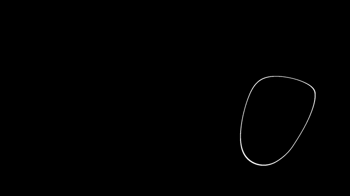

# Bubbles

A animated wallpaper for [Lively Wallpaper](https://www.rocksdanister.com/lively/) that generates smooth, flowing blob shapes using a WebGL cubic noise shader.



> 🌐 **[Try it live in your browser →](https://bubbles.toomcis.eu)** *(interactive preview with editable parameters)*

---

## Download & Install

1. Head to the [**Releases**](https://github.com/toomcis/Bubbles/releases) page
2. Grab the latest **`Bubbles.zip`**
3. Drag and drop the zip straight into **Lively Wallpaper**
4. Customize it to your heart's content from Lively's settings panel

That's it — no extracting, no extra steps.

---

## How it works

The effect is driven by a 3D cubic noise field sampled over time. A threshold is applied to the noise — any value within a certain range gets colored as the line/fill, everything else becomes the background. The noise is rotated in 3D space to prevent axis-aligned artifacts, giving the blobs their smooth organic movement.

---

## Properties

### General

| Property                   | Description                                              |
| -------------------------- | -------------------------------------------------------- |
| **Speed**            | How fast the blobs animate. 0 = frozen, higher = faster. |
| **Line Color**       | Color of the blob outlines or fill.                      |
| **Background Color** | Color of the empty space.                                |

### Shape

| Property            | Description                                                                                                                                                         |
| ------------------- | ------------------------------------------------------------------------------------------------------------------------------------------------------------------- |
| **Density**   | Controls where in the noise field the threshold sits. 0.5 = most blobs visible, 0 or 1 = almost nothing. It's not linear — think of it as tuning into a frequency. |
| **Thickness** | Width of the line band. Slide to max for fully filled solid blobs.                                                                                                  |

### Quality

| Property                                    | Description                                                                                                                                                                                                        |
| ------------------------------------------- | ------------------------------------------------------------------------------------------------------------------------------------------------------------------------------------------------------------------ |
| **Uniform Line Width** ⚠️ GPU HEAVY | Switches to a pixel-accurate border mode. Instead of a raw noise band, it computes the actual pixel distance to the blob edge so the line stays the same width everywhere — no more thin pinches on tight curves. |
| **Interior Brightness**               | Only active in Uniform mode. Controls how bright the inside of the blobs is. 0 = fully background color, 1 = fully line color.                                                                                     |

---

## Modes

### Standard mode

The default. A band of noise values between `density ± thickness/2` gets colored. Fast and lightweight. Line width varies naturally with the noise gradient slope.

### Uniform Line Width mode

Computes the gradient of the noise field at each pixel to estimate the true screen-space distance to the iso-contour. The border is drawn at a consistent pixel width regardless of how steep or shallow the noise slope is at that point. Uses 4 extra noise samples per pixel, so it costs more GPU — but looks much cleaner.

### Filled mode

Activate by pushing **Thickness** to its maximum. Switches from a band to a simple fill: everything below the density threshold becomes solid. Works in both standard and uniform modes.

---

## Files

```
Bubbles/
├── index.html             # WebGL shader — the wallpaper itself
├── LivelyProperties.json  # Exposes controls to Lively's settings panel
├── LivelyInfo.json        # Wallpaper metadata (title, author, preview)
├── t.png                  # Thumbnail shown in Lively's library
└── p.gif                  # Animated preview
```

---

## Author

**[Toomcis](https://toomcis.eu)** — [github.com/toomcis](https://github.com/toomcis)
